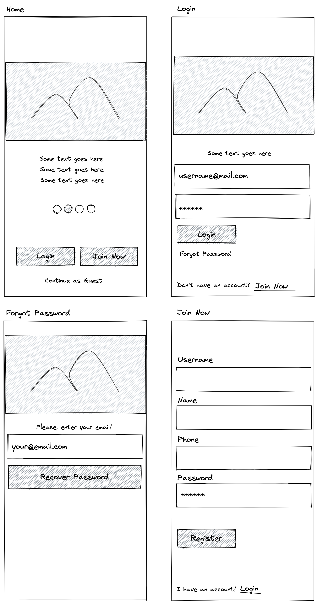

# SwiftUI - Упражнение 2

Създайте проект, в който реализирате следните 4 екрана като различни компоненти.

* HomeView
    - съдържа галерия с картинка и текст
    - бутон вход
    - бутон присъединисе сега (регистрация)
    - бутон влез като гост
* Login 
    - съдържа картинка и текст
    - поле за потребителско име 
    - поле за парола
    - бутон за Логин
    - бутон за забравена парола
    - бутон за присъедини се сега
* Join Now
    - поле за потребителско име
    - поле за има
    - поле за телефон (добавете възможността да се въвежда валиден телефонен номер)
    - поле парола
    - бутон регистрирай
    - бутон вход
* Forgot Password
    - картинка (забавна да подскаче, че всеки забравя)
    - текст
    - поле за имейл
    - бутон за рестартиране на паролата
    
> Потребителското име е email.

## Бонус задачи

Опитйате се реализирате глобален регистър (списък) на потребителите в паметта на телефона. При регистриране на нов потребител го добавяйте. При логинг проверявайте дали има такъв.
Приемливо е при рестарт на приложението списъкът да се занулява, ако го държите в паметта само.