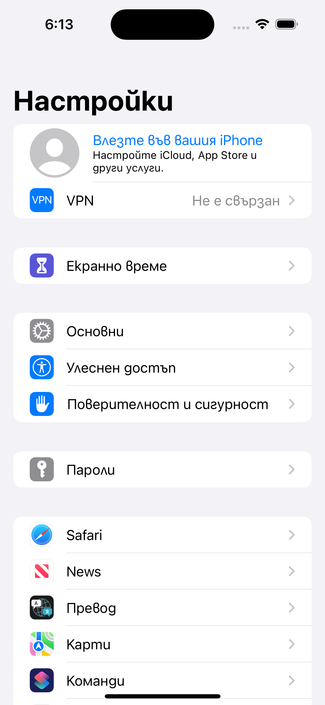

# SwiftUI - Упражнение 3

Създайте проект, който има свой модел и реализира изглед подобен на System Preferences екрана в iOS. 

* System Preference
    - модел, в който са описани всички елементи
    - иконите
    - текстовете

## Бонус задачи

Опитайте се да реализирате навигация сами.

Опитайте се да реализирате навигация с помощта на NavigationView.