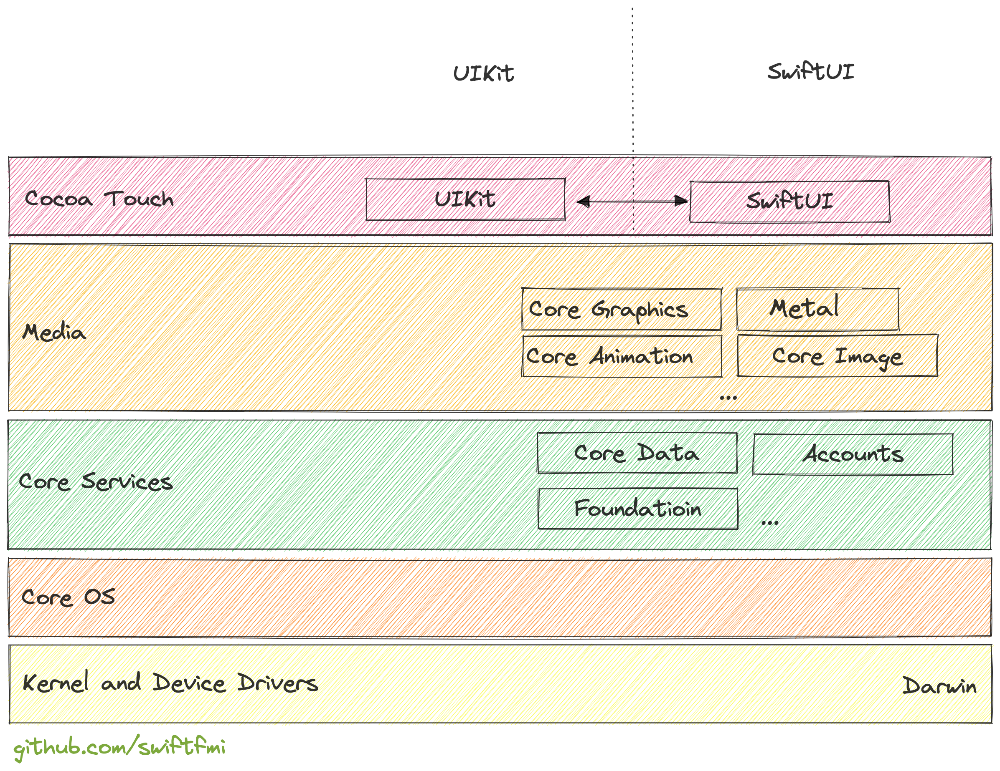

# История на iOS и Swift

## За курса
Това издание на курса се фокусира над овладяването на `SwiftUI` и запознаването с `UIKit`. След този курс, студентите трябва да могад спокойно да създават мобилни приложения за `iOS` с помощта на `SwiftUI`/`UIKit`. Да могат да добавят външни модули с допълнителна функционалност. Приложението ще може комуникира със сървър, ще може да изпозлва специфични функции на устройството. Студентите ще научат как да публикуват приложението си в Аппстор и как да ползват инструменти, за да изготвят версии на своето приложение. Ще могат и да пишат __unit__ и __UI__ тестове.   

1. Представяне на екипа
    > В това издание на курса ще участват:

        1. Емил Атанасов
        1. Спас Билиарски (гост лектор)
        1. Драгомир Иванов (гост лектор)
1. Как ще се провежда курса?
    * Къде ще се провеждат лекциите?
        * Лекциите ще се провеждат или в зала или онлайн (предстои да бъде решено). 
    * Поради липсата на съвременни макове и зала във ФМИ, упражненията ще бъдат провеждани онлайн.
        * Т.е. ще има час/ден, в който ще се събираме във виртуална стая (google meet). Ще бъде давано задание. Всеки ще трябва да си 
направи github репозитори, в което да споделя кода за съответното упражнение.
    > Важно: По средата на курса ще има онлайн тест в moodle, който всеки трбява да реши. Явяването на теста ще стане чрез решаване в зала с лаптоп. (на живо)
1. Как ще се оценява?
    * Подари големият обем информация на курса, оценяването ще включва следните основни елементи:
        * теоритични знания - решение на два затворен тест-а. Един по средата на курса и един в края на курса. (2 х 5%)
        * практически знания -  решението на задание по средата на семестъра (20% )
        * работа в екип - цялостно представяне на финалния екипен проект (25 %)
        * индивидуална работа - тук се разглежда приноса на студента в екипа. (45%)

> За отлична оценка трябва да имате комплексни зания по дициплината. Само теория няма да е достатъчна. Само практика - също.

> Целта е да научите, че теорията и практиката се допълват и отличните резултати при изграждането на софтуер зависят и от двете.

## iOS - история и структура

iOS започва своето съществуване като операционна система, която е оптимизирана специално за мобилни устройства (още през 2007 година). Тя е базирана на [macOS](https://en.wikipedia.org/wiki/MacOS) (`Mac OS X` по това време, после само `OS X`), като идеята е да позволи управлението на мобилният телефон, който Apple създават. В последствие започва да се ползва и за други устройства и бива преименувана за съответните употреби.
Всяка година излиза по една нова версия. Тази година е пуснатата версия 16

Повече по темата може да намерите [тук](https://bg.wikipedia.org/wiki/IOS).

### Swift и Obj-C (C & C++)
    
Без да навлизаме в излишни детайли, следните езици `Swift и Obj-C (C & C++)` са използвани за реализирането на iOS. Съoтветно, същите могат да бътдат използване за изграждане на приложения за операционната система `iOS` и прозиводните й. (Може да се ползват и други технологии/езици за програмиране, но те няма да бъдат разглеждани в детайли. Всичките по един или друг начин се свързват с горните основни езици.).

`Swift` (вече версия 5.7) се счита за съвременния и по-приятния език за разработка за iOS. Има редица нововъведения, които правят работата с него лесна и приятна. `Obj-C` се приема за предишния най-популярен език за програмиране в `Apple` еко-системата. 

Може да прочете повече за `Swift` в записките ни свързани с курса `Програмиране със Swift`, който се води през летния семестър във ФМИ, [тук](https://github.com/swiftfmi/SwiftLectures).

### Unix
    
macOS е базирана на Unix оперционна система (не разглеждаме графичната среда). Това ядро е отделна операционна систма (без графичен интерфейс). Нарича се [`Darwin`](https://en.wikipedia.org/wiki/Darwin_(operating_system)).
Тя е с [отворен код](https://github.com/apple/darwin-xnu), но не се изпозлва на други места освен Аpple съвместими устройства.
`Darwin` e основата на която стъпва `macOS`, `iOS` и производните операционни системи.
Графичната среда `Cocoa` надгражда това ядно и е със затворен. Което прави, iOS и macOS операционни системи със затворен код.

[`Cocoa Touch`](https://en.wikipedia.org/wiki/Cocoa_Touch) е модифицираната версия, която се изпозлва в `iOS`. 

> Свърва се с Чарлс Дарвин. Понеже Стийв Джобс по това време на чело на Apple казва, че е време за еволюция.

### Слоеве CoreOS, Core Services, Media, Cocoa Touch
   
Архитектурата на iOS е многослойна. Различните слоеве отговарят за различни задачи.

На върха е `Cocoa Touch` представлявана от `UIKit` или `SwiftUI`. С тези библиотеки се изгражда визуалната част на iOS приложение.
После следват `Media` библиотеките - които са посредник между интерфейса и другите основни услуги в операционната система.   

### UIKit & SwiftUI

Двете основни библиотеки за изграждане на потребителски интерфейс.
Този курс ще се фокусира над `SwiftUI` вече версия 3.
Ще разгледаме информативно и UIKit, за да можем да разбираме как се работи с проекти изградени преди време. Но основните механизми, ще бъдат тясно свързани с нововъведенията в `iOS`. Версията на `iOS`, която ще позлваме е `16`. Версията на `XCode` - средата за програмиране - 14.

### Среда за програмиране

    macOS + Xcode/Swift Playground
    iPadOS + Swift Playground

### Списък на различни библиотеки част от iOS (16)

Списъкът е взет директно от [официалната документация](https://developer.apple.com/documentation/technologies?tags=App%20Services) на `Аpple`.

#### Accounts
    Help users access and manage their external accounts from within your app, without requiring them to enter login credentials.

#### Address Book
    Access the centralized database for storing users’ contacts.

#### Address Book UI
    Access users’ contacts and display them in a graphical interface.

#### AdServices
    Attribute app-download campaigns that originate from the App Store, Apple News, or Stocks on iOS devices.

#### AdSupport
    Provide apps with access to an advertising identifier.

#### App Intents
    Extend your app’s custom functionality to support system-level services like Siri and the Shortcuts app.

#### App Store Receipts
    Validate app and in-app purchase receipts with the App Store.

#### App Store Server API (not directly used in iOS)
    Manage your customers’ App Store transactions from your server.

#### App Store Server Notifications
    Monitor in-app purchase events in real time with server notifications from the App Store.

#### Apple Maps Server API (NDU in iOS)
    Reduce API calls and conserve device power by streamlining your app’s georelated searches.

#### Application Services
    Perform common application tasks.

#### Automatic Assessment Configuration
    Enter single-app mode and prevent students from accessing specific system features while taking an exam.

#### Background Assets
    Schedule background downloads of large assets after app installation, when the app updates, and periodically while the app remains on-device.

#### Background Tasks
    Request the system to launch your app in the background to run tasks.

#### CallKit
    Display the system-calling UI for your app’s VoIP services, and coordinate your calling services with other apps and the system.

#### CareKit
    Create apps that help people better understand and manage their health.

#### CarKey
    Access the remote keyless features of configured vehicles in the Wallet app.

#### CarPlay
    Integrate CarPlay in apps related to audio, communication, navigation, parking, EV charging, and food ordering.

#### ClassKit
    Enable teachers to assign activities from your app’s content and to view student progress.

#### ClassKit Catalog API (NUD in iOS)
    Declare the activities supported by your educational app through a web interface.

#### ClockKit
    Display app-specific data on the clock face.

#### CloudKit
    Store structured app and user data in iCloud containers that all users of your app can share.

#### Combine *
    Customize handling of asynchronous events by combining event-processing operators.

#### Contacts
    Access the user's contacts and format and localize contact information.

#### Contacts UI
    Display information about users’ contacts in a graphical interface.

#### Core Data *
    Persist or cache data on a single device, or sync data to multiple devices with CloudKit.

#### Core Location *
    Obtain the geographic location and orientation of a device.

#### Core Location UI
    Streamline access to users' location data through a standard, secure UI.

#### Core ML *
    Integrate machine learning models into your app.

#### Core Motion
    Process accelerometer, gyroscope, pedometer, and environment-related events.

#### Core Spotlight
    Index your app so users can search the content from Spotlight and Safari.

#### Core Text
    Create text layouts, optimize font handling, and access font metrics and glyph data.

#### Core Transferable
    Declare a transfer representation for your model types to participate in system sharing and data transfer operations.

#### Create ML *
    Create machine learning models for use in your app.

#### Create ML Components
    Leverage customizable machine learning models in your app.

#### Device Activity
    Monitor device activity with your app extension while maintaining user privacy.

#### DeviceCheck
    Reduce fraudulent use of your services by managing device state and asserting app integrity.

#### EventKit
    Create, view, and edit calendar and reminder events.

#### EventKit UI
    Display an interface for viewing, selecting, and editing calendar events and reminders.

#### ExtensionFoundation 
    Create executable bundles to extend the functionality of other apps.

#### ExtensionKit
    Create executable bundles to extend the functionality of other apps by presenting a user interface.

#### Family Controls
    Authorize your app to provide parental controls on a child’s device.

#### File Provider
    An extension other apps use to access files and folders managed by your app and synced with a remote storage.

#### File Provider UI
    Add actions to the document browser's context menu.

#### HealthKit
    Access and share health and fitness data while maintaining the user’s privacy and control.

#### HomeKit
    Configure, control, and communicate with home automation accessories.

#### iAd
    Attribute app downloads that originate from Apple Search Ads campaigns.

#### JavaScriptCore *
    Evaluate JavaScript programs from within an app, and support JavaScript scripting of your app.

#### MailKit
    Secure, customize, and act on email messages that users send and receive.

#### Managed Settings
    Access and change settings with your app while maintaining user privacy and control.

#### Managed Settings UI
    Define and configure the appearance of shielding views.

#### MapKit *
    Display map or satellite imagery within your app, call out points of interest, and determine placemark information for map coordinates.

#### Message UI
    Create a user interface for composing email and text messages, so users can edit and send messages without leaving your app.

#### Messages
    Create app extensions that allow users to send text, stickers, media files, and interactive messages.

#### Multipeer Connectivity
    Support peer-to-peer connectivity and the discovery of nearby devices.

#### Natural Language
    Analyze natural language text and deduce its language-specific metadata.

#### Notification Center
    Create and manage widgets for the Today view.

#### PassKit (Apple Pay and Wallet)
    Process Apple Pay payments in your app, and create and distribute passes for the Wallet app.

#### Preference Panes
    Integrate your app's custom preferences into the System Preferences app.

#### ProximityReader
    Read contactless physical and digital wallet cards using your iPhone.

#### Push to Talk
    Display the system user interface for your app’s Push to Talk services.

#### PushKit
    Respond to push notifications related to your app’s complications, file providers, and VoIP services.

#### QuickLook
    Create previews of files to use inside your app, or perform simple edits on previews.

#### QuickLook UI (macOS)
    Create previews of files to use inside your macOS app.

#### Roster API
    Read user and class information from an Apple School Manager organization.

#### Safari Services
    Enable web views and services in your app.

#### Shared with You
    Surface shared content and collaborate in your app.

#### SiriKit
    Empower users to interact with their devices through voice, intelligent suggestions, and personalized workflows.

#### SMS and Call Reporting
    Create extensions to manage and report unwanted SMS messages and spam calls.

#### Social
    Post content to supported social networking services, using standard system interfaces.

#### Speech
    Perform speech recognition on live or prerecorded audio, receive transcriptions, alternative interpretations, and confidence levels of the results.

#### StoreKit
    Support in-app purchases and interactions with the App Store.

#### Swift Charts (SwiftUI)
    Construct and customize charts on every Apple platform.

#### Tabular Data
    Import, organize, and prepare a table of data to train a machine learning model.

#### Thread Network
    Share credentials and choose a designated network for each home.

#### TV Services (tvOS)
    Display content and descriptions, provide channel guides, and support multiple users on Apple TV.

#### User Notifications *
    Push user-facing notifications to the user’s device from a server, or generate them locally from your app.

#### User Notifications UI
    Customize the interface that displays local and remote notifications.

#### Vision
    Apply computer vision algorithms to perform a variety of tasks on input images and video.

#### VisionKit
    Add Live Text features to images, scan data in the camera’s viewfinder, and scan documents.

#### Wallet Orders
    Create, distribute, and update orders in Wallet.

#### Wallet Passes
    Create, distribute, and update passes for the Wallet app.

#### Watch Connectivity
    Implement two-way communication between an iOS app and its paired watchOS app.

#### WeatherKit
    Deliver weather conditions and alerts to your users.

#### WeatherKit REST API
    Obtain historical, current, and predictive weather for your app or service.

#### WebKit
    Integrate web content seamlessly into your app, and customize content interactions to meet your app’s needs.

#### WidgetKit
    Show relevant, glanceable content from your app as widgets in iOS and macOS, and as watch complications.
