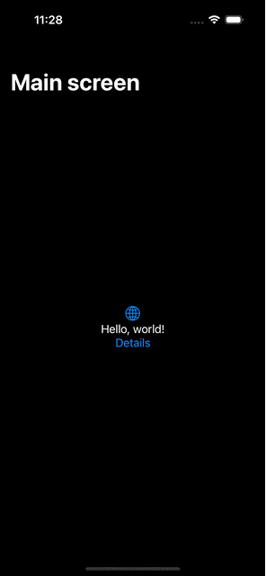

# Navigation
В `iOS` е прието, че не цялата информация може да се изобрази на един екран на мобилно устройство и има много добър механизъм за навигиране. Т.е. ако трябва да представите информация, която има общ и детайлен изглед тогава трябва да ползвате `NavigationView`. 

Този компонент позволява лесно отваряне на нови екрани, които се показват на екрана на устройството с приятна плавна анимация. Екраните се държат като стек - т.е. само най-горният е видим и потребителя може да работи с него. Това изгражда представата, за визуално разположение на информацията в позлващия приложениято и как лесно да се върне обратно към предишния екран.

> Лесното връщане става или с бутон от заглавната лента или с back-swipe жест от левия край на екрана на устройството.

Механизмът за навигиране напред и назад се допълва и от възможността за наименуване на всеки екран. С това се дава допълнителен ориентир, който прави ориентацията на потребителя в приложението пълна и ясна. 



> В примера горе, виждаме че основния екран има заглавие и то се казва `Main screen`. При натискане на бутона `Details`, нов екран се показва с плъзгаща анимация от дясната част на екрана. През това време заглавието се смалява и се превръща в back бутон (горе в ляво). Така, без много чудене знаем какво ще се случи, ако натиснем `< Main screen` бутона.

## Как можем да реализираме това?

```swift
struct ContentView: View {
    var body: some View {
        NavigationView {
            // тук определяме как ще изглежда основния екран
            VStack {
                Image(systemName: "globe")
                    .imageScale(.large)
                    .foregroundColor(.accentColor)
                Text("Hello, world!")
                NavigationLink {
                    // конструиране на нов обект (не е видим още)
                    DetailsView()
                } label: {
                    Text("Details")
                }
            }
            .padding()
            // можем да сложим заглавието по следния начин
            .navigationTitle("Main screen")
        }
    }
}
```

Компонентът за навигация, който се изпозлва `NavigationLink`. 
Той позволява да подберем подходяща презентация(изглед) на елемента, който ще осъществи навигацията. Това става като определим неговия изглед в `label: {
}` параметъра.

Ето как изглежда и екранът, който изобразява детайлите:

```swift
struct DetailsView: View {
    // пропърти wrapper, който ни позволява да се върнем стъпка назад
    @Environment(\.presentationMode) var mode
    @State var counter: Int
    init() {
        // този принт се отпечатва при инициализирането на самото view,
        // което става още на предния екран (в NavigationLink компонента)
        print("Init details view")
        self._counter = State(initialValue: 0)
    }

    var body: some View {
        VStack {
            Text("State counter = \(counter)")
            Button("+1") {
                // бутон, който променя брояча с едно нагоре
                counter += 1
            }
            Button("Back") {
                // с този механизъм можем да 
                // се върнем стъпка назад
                mode.wrappedValue.dismiss()

            }
        }
        // така слагаме заглавие, което ще се използва, ако имаме NavigationView
        .navigationTitle("Details view")
    }
}
```

> `DetailsView` няма представа дали ще бъде извикано и кога, но самото view бива конструирано.

Ако искаме да започнем някакви действия, когато самото view е показано на екрана, тогава трябва да ползваме следния модификатор:

```swift
.onAppear {
    // действията, които трябва да направим, само ако потребителя наистина 
    // навигира към този компонент. 

    // тук често стои зареждането на допълнителна информация
}
```

> Асинхронни действия не се правят в конструктора на view-та. Самите view-та са малки обекти, които се конструират с лекота. Те съдържат рецептата какво трябва да има на екрана във всеки един момент според състоянието, но те не съхраняват визуалните компонент, които виждаме на екрана. 

Всички насленици на `View` протокола от `SwiftUI` са само инструкции какво да има на екрана и механизъм за съхранения на състоянието (има различни конкретни инструменти, които са предоставени от фреймуорка и разгледани в предишните лекции).

От `iOS` 16 - `NavigationView` e depricated. T.e. след няколко брой версии ще бъде премахт от `iOS`. Правилния компонент, към който трябва да се насочите, ако разработвате за iOS 16 или по нова версия се нарича `NavigationStack`.

Ето и същия екран с новата контрола:

```swift
struct HomeView: View {
    var body: some View {
        NavigationStack {
            VStack {
                Image(systemName: "globe")
                    .imageScale(.large)
                    .foregroundColor(.accentColor)
                Text("Hello, world!")
                NavigationLink {
                    DetailsView()
                } label: {
                    Text("Details")
                }

            }
            .padding()
            .navigationTitle("Home screen")
        }
    }
}
```

### Трябва ли да използваме тази нова контрола?

Препоръчително е да изградите две `view`-та, като едно се ползва за всички версии до `iOS` 15 включително, а другото `view`, което разчита на `iOS` 16 или по-нова.

Ето как можем да направим това:

```swift
@main
struct SwiftUI_NavigationApp: App {
    var body: some Scene {
        WindowGroup {
            // ако е iOS 16 тогава ползва HomeView 
            if #available(iOS 16.0, *) {
                HomeView()
            } else {
                ContentView()
            }
        }
    }
}

```

### С какво тя е по-добра от предишната?

Новият механизъм за навигация предоставя възможност да работим с типове и конкретни стойности. Това ни позволява да можем да обработваме лесно различни типове.
Също така конструирането на view-то се извършва в един по-късен етап, когато потребителя избере съответния елемент и той се подаде на регистрирания обработчик. 

Ето как би изглеждало всичко това, ако имахме собствен тип елеменети `Car` и трябваше да отворим детайлен екран, в който да изобразим информацията за тях.

```swift
// тип кола
class Car {
    var name: String
    var speed: Double
    
    init(name: String, speed: Double) {
        self.name = name
        self.speed = speed
    }
}
// за да можем да ползваме типа с NavigationStack
extension Car: Identifiable {
    var id: String {
        name
    }
}

extension Car: Hashable {
    static func == (lhs: Car, rhs: Car) -> Bool {
        lhs.name == rhs.name
    }
    
    func hash(into hasher: inout Hasher) {
        name.hash(into: &hasher)
    }
}
// тип ЕлектрическаКола, надгражда типа кола
class ECar: Car {
    var batteryCapacity: Double
    
    init(name: String, speed: Double, batteryCapacity: Double) {
        self.batteryCapacity = batteryCapacity
        super.init(name: name, speed: speed)
    }
}
// списък с коли
struct CarListView: View {
    @State var cars = [
        ECar(name: "Tesla Model X", speed: 250, batteryCapacity: 300),
        Car(name: "Mercedes EQS", speed: 250),
        Car(name: "IONIC 5", speed: 200)
    ]

    var body: some View {
        NavigationStack {
            List(cars) { car in
// старият вариант
//                NavigationLink {
//                    CarDetailsView(car: $car)
//                } label: {
//                    Text(car.name)
//                }
                // новият вариант с подаване на стойност
                NavigationLink(car.name, value: car)
            }
            .navigationTitle("Cars")
            // регистрираме обработчик на данни от тип Car
            .navigationDestination(for: Car.self) { car in
                    CarDetailsView(car: car)
            }
        }
        
    }
}

struct CarDetailsView: View {
    var car: Car
    var body: some View {
        VStack {
            Text(car.name)
                .font(.largeTitle)
            if let c = car as? ECar {
                Group {
                    Text("Electrical")
                    Text("Battery: \(c.batteryCapacity)")
                }
            }
            HStack {
                Text("Top Speed: ")
                Text("\(car.speed) km/h")
            }
        }
        .navigationTitle(car.name)
    }
}
```

Ако искаме да подадем моделите за редактиране, трябва да изпозлваме подходящие механизми в `SwiftUI`. Крайното решение зависи от това какъв модел сме избрали за нашите данни.

# TabView

Тук ще разгледаме една от основните котроли за логическо разделение на приложението на основни части. Тази контрола се налича `TabView`. 

Ето и как изглежда тя:

# SplitView

# Scenes (iPadOS)
