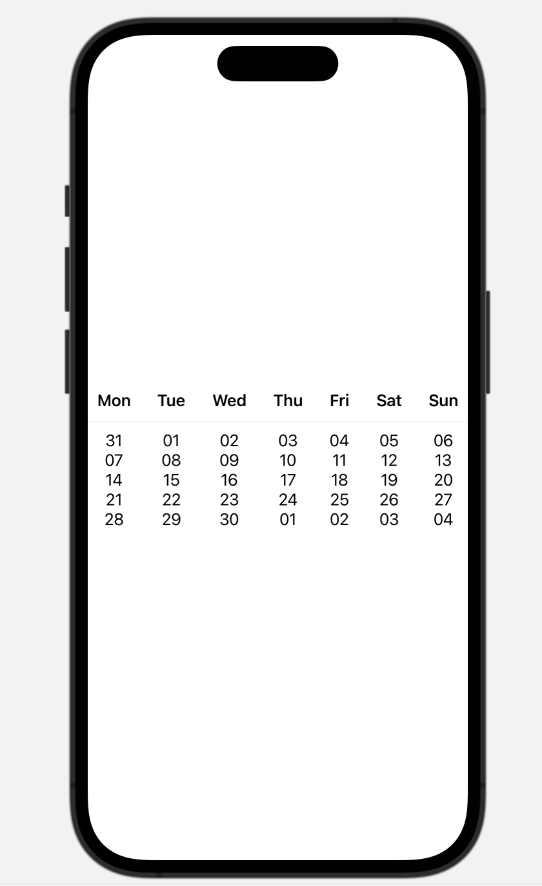

# Задание - `Календар`

Започвате от проекта, който се намира в текущата директория.
В него имате дадени помощни средства, които ще ви помогнат при
реализирането на решението.

Трябва да реализирате следните функционалности:
1. Да се визуализира календар с помощта на `Grid` контролата в `SwiftUI`. 
    > Ако нямате iOS 16, тогава използвайте други познати средства.
    > за целта ползвайте `MonthView`
    * Използвайте черен цвят за дните от седмицата
    * използвайте червен цвят за почивните дни
    > Моделът, предоставя необходимите данни.

Пример:

2. При избор на дата от календара да се показва нов екран със задачите за съответния ден.
    > за целта ползвай `DayView`
    > Не всяка дата (ден от календара) има задачи. Представете това по подходящ начин, ако няма никакви задачи за съответния ден.
3. Всяка задача да може да се маркира като изпълнена.
    > Виж `TaskView`
4. Да се запазват изпълнените задачи при смяна на датите. Т.е. състоянието на задачите да е "устойчиво" при разглеждане на няколко различни дати.

Време за работа: __120__ min

Начин на предаване на решението:
- Архивиране и пращане по slack на лично съобщение.